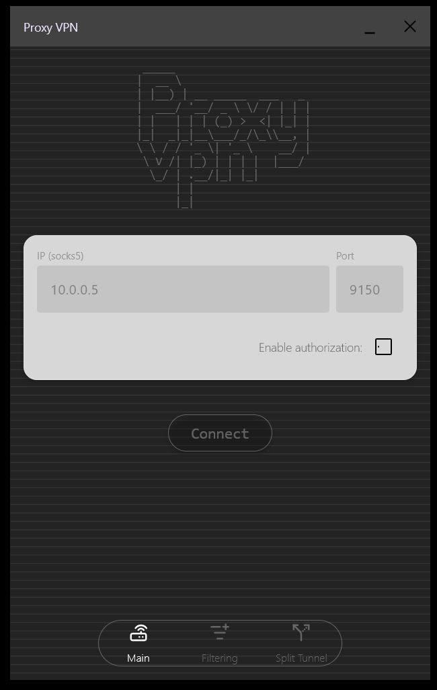
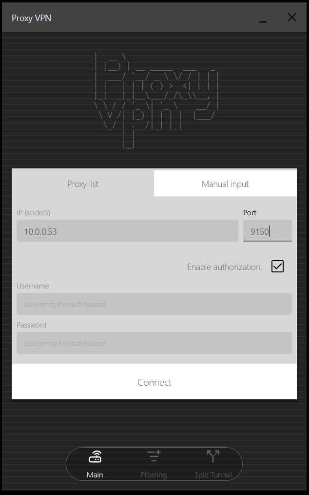
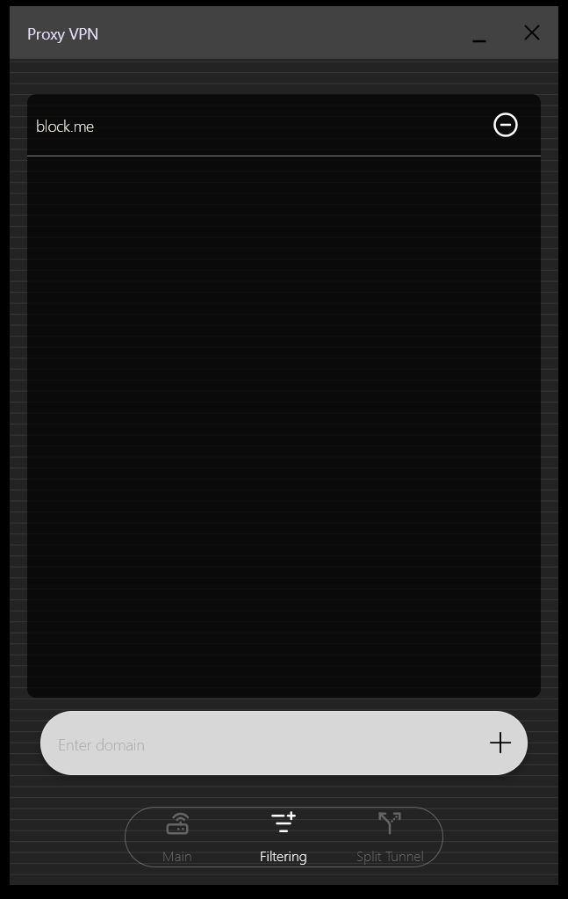
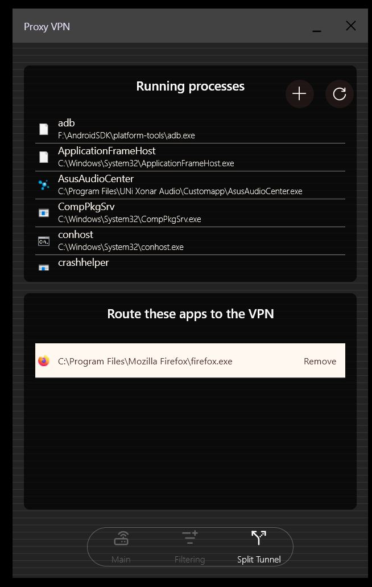

# ProxyVPN

A cross-platform VPN application built using **Kotlin Multiplatform (KMP)**, targeting **Android**
and **Windows (JVM)**.

## Overview

This project demonstrates a VPN implementation sharing core logic across platforms while providing
native-like experiences for both mobile and desktop users. It uses **sing-box** as the core
networking engine to handle secure tunneling and proxying.

## Platforms

- **Android**: Mobile application with system-level VPN integration.

  ### Android Demo    

  https://github.com/user-attachments/assets/7682044f-f60d-4b2c-868b-3a33e7ffde44

- **Windows**: Desktop application for secure connectivity on JVM-based systems.

  ### Windows Demo
  | *Main Screen (Proxy list)* | *Main screen (Manual input)* | *DNS Filtering Feature*  | *Split Tunneling Feature*       |
    |----------------------------|------------------------------|--------------------------|--------------------|
  |    |      |  |  |
  
## Features

- **Sing-box Core**: Powered by the sing-box universal network stack for high-performance proxying.
- **Split Tunneling**: Choose which apps route through the VPN.
- **DNS Filtering**: Block unwanted domains at the network level.
- **Shared UI/Logic**: Built with Compose Multiplatform and Decompose for efficient development.

## Credits

- **Proxy List**: This project uses a public proxy list provided
  by [proxifly/free-proxy-list](https://github.com/proxifly/free-proxy-list).

## Project Structure

- `:androidApp`: Android-specific application code.
- `:desktopApp`: Windows/JVM-specific desktop application code.
- `:shared`: Core business logic, UI components, and domain filtering.
- `:utils`: Shared utility functions and database management.
